# AlphaHook - ETHGlobal Singapore 2024

A project by [@CJ42](https://github.com/CJ42) and [@Hugoo](https://github.com/Hugoo) for [ETHGlobal Singapore 2024](https://ethglobal.com/events/singapore2024) hackathon.

This repo is based on [@uniswapfoundation/v4-template](https://github.com/uniswapfoundation/v4-template).

## Description

### Uniswap V3

In Uniswap V3, fees are fixed within each specific pool. As a result, for certain trades, the router may need to execute swaps across multiple pools. The fee structure is closely related to the price volatility of a trading pair. For stable pairs, such as USDC/USDT, low-fee pools are typically favored. Conversely, for high-volatility pairs, liquidity providers tend to prefer pools with higher fees to better compensate for the risks involved.

```mermaid
graph LR
    A[🧑‍💻 Trader] --> B[🔀 Router]
    B --> C
    B --> D
    B --> E
    B --> F
    subgraph Pool V3 A/B
    C[0.01% Fees]
    D[0.05% Fees]
    E[0.30% Fees]
    F[1.00% Fees]
    end
```

One challenge with this architecture is that liquidity can become "trapped" in a pool where the fees no longer align with the volatility of the pair. For example, a pair involving two newly launched tokens may experience significant price volatility, making high fees desirable. However, as the price stabilizes over time, lower fees would become more appropriate. Currently, adjusting fees requires liquidity providers to withdraw from one pool and reallocate to another. With Uniswap V4 hooks, this process can be automated, enabling dynamic fee adjustments without requiring manual intervention from liquidity providers.

### Uniswap V4

On Uniswap V4, we can leverage hooks to adjust the fees automatically. In this project, we show a way to adjust the pool fees dynamically.

```mermaid
graph LR
    A[🧑‍💻 Trader] --> B[🔀 Router]
    B --> C
    subgraph Pool V4 A/B
    C[Dynamic Fees]
    end
```

## Implementation

Our application leverages hooks before and swap have occurred, with some custom Solidity logic.

The goal was to explore hooks for the following use cases:

- Dynamic Fees - showcase potential hooks that rely on dynamic fees to reward LPs or swappers
- Hook Fees - showcase novel hook fee designs

The `PoolManager` uses permissions to determine which hook functions to call for a given pool on a Hook contract.

Since we used the Uniswap v4 hooks only for operations related to swapping, we specified only the permissions for the `beforeSwap` and `afterSwap` in the hook contract.

## Next steps

If the hook contract exposes relevant variables, and function a frontend can nicely display the information to the user.

## Resources

We have explored the following documentation pages to develop our submission:

- https://docs.uniswap.org/contracts/v4/concepts/hooks
- https://docs.uniswap.org/contracts/v4/guides/hooks/swap

## Feedback

- When searching "Uniswap V4" on Google, the first link to <https://docs.uniswap.org/contracts/v4/concepts/intro-to-v4> is a broken link. Maybe a redirect can be added to fix this.
